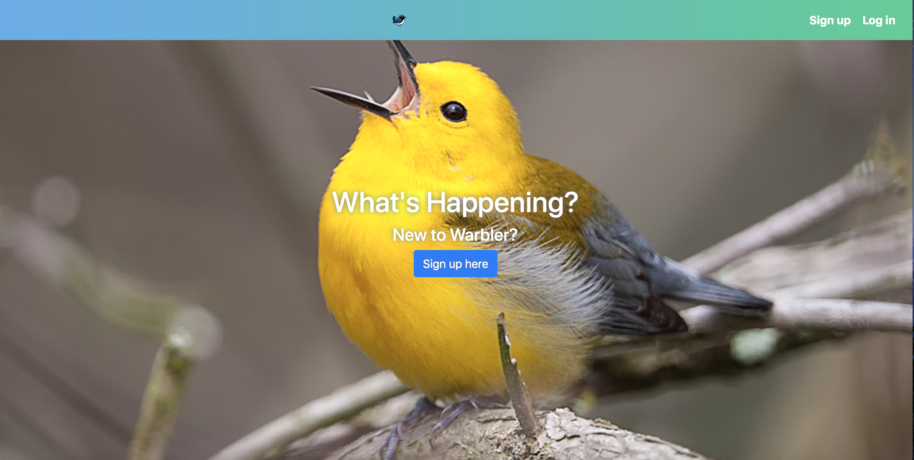
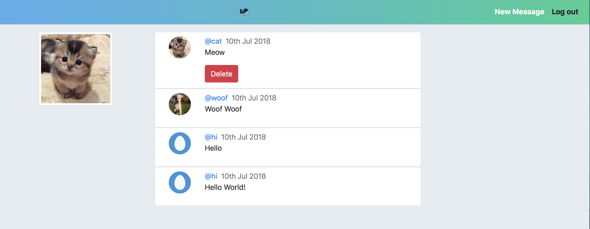

# Warbler

## Description

A react redux application which works as a Twitter Clone.

The front-end is developed with the help of React and Redux(State Management)

The back-end database is hosted on MLab as MongoDB on Cloud. It is rendered with the help of a custom built API :

## Links

API Link : https://react-warbler-api.herokuapp.com/

Warbler Link: https://react-warbler.herokuapp.com

## Screenshots

--  

